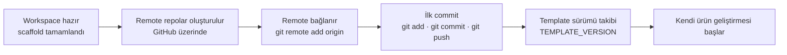

# İlk Template Kullanımı

Workspace scaffold edildikten sonra — eğer `-InitGitRepos` bayrağı kullanıldıysa — `demo/` ve `commercial/` dizinleri birer git reposudur; aksi hâlde her iki dizinde `git init`'i manuel çalıştırın. Bu rehber ilk commit'ten itibaren template'in nasıl kullanılacağını açıklar.

## Genel Akış



## 1. Remote Repoları Oluşturun

GitHub üzerinde iki ayrı repo açın:

| Repo | Görünürlük | Öneri |
|------|-----------|-------|
| `demo` reposu | **Public** | Ürünün public yüzü |
| `commercial` reposu | **Private** | Ticari / private içerik |

!!! info "Organizasyon önerisi"
    Public demo repoları `drokian` hesabında, private ticari repolar `docyazilim` organizasyonunda barındırılabilir. Bu ayrım, erişim kontrolünü netleştirir.

## 2. Remote'ları Bağlayın

=== "demo reposu"

    ```bash
    cd <hedef-dizin>/demo
    git remote add origin https://github.com/<kullanici>/<demo-repo-adi>.git
    ```

=== "commercial reposu"

    ```bash
    cd <hedef-dizin>/commercial
    git remote add origin https://github.com/<org>/<commercial-repo-adi>.git
    ```

## 3. İlk Commit

Her iki repo için:

```bash
git add .
git commit -m "chore: scaffold demo-commercial-template v1.0.0"
git branch -M main
git push -u origin main
```

## 4. Template Sürümü Takibi

Scaffold sırasında kullanılan template sürümünü kaydetmek, ilerideki güncellemeleri izlemeyi kolaylaştırır. `TEMPLATE_VERSION` dosyası scaffold ile workspace'e kopyalanmaz; sürümü Harmonia meta-workspace içindeki kaynak konumda görebilirsiniz:

```
templates/demo-commercial-template/TEMPLATE_VERSION  → v1.0.0
```

Kullandığınız sürümü `development/` klasörünüzdeki bir nota veya workspace README'sine kaydedin:

```bash
echo "TEMPLATE_VERSION=v1.0.0" >> development/workspace-notes.md
```

!!! note "Güncellemeler"
    Template'in yeni sürümleri yayımlandığında Harmonia meta-workspace'i güncelleyin ve değişiklikleri `templates/demo-commercial-template/TEMPLATE_CHANGELOG.md` dosyasından inceleyin.

## 5. Geliştirmeye Başlayın

Workspace hazır. Kendi ürün kodunuzu `demo/` ve `commercial/` dizinleri içinde geliştirmeye başlayabilirsiniz.

!!! tip "Branch stratejisi"
    Her iki repoda da `develop` branch'i açmanızı ve `main`'i yalnız release snapshot'ları için korumanızı öneririz. Bu yaklaşım Harmonia'nın kendi branch ve tag kurallarıyla örtüşür.
