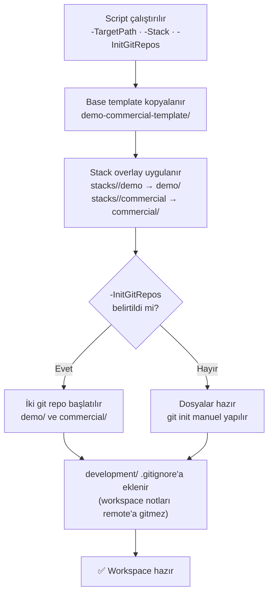

# Workspace Oluşturma

Bu rehber, Harmonia'nın `scaffold-demo-commercial.ps1` scripti ile yeni bir workspace iskeletinin nasıl üretildiğini açıklar.

## Gereksinimler

- **PowerShell 7+** — Linux/WSL'de `pwsh`, Windows'ta `powershell.exe`
- Harmonia meta-workspace'in lokal kopyası (`drokian/harmonia-platform`)

## Scaffold Akışı



## Komut

```powershell
pwsh -File ./templates/demo-commercial-template/development/scripts/scaffold-demo-commercial.ps1 `
    -TargetPath "<hedef-dizin>" `
    -Stack <stack-adı> `
    -InitGitRepos
```

### Parametreler

| Parametre | Zorunlu | Açıklama |
|-----------|---------|----------|
| `-TargetPath` | Evet | Workspace'in oluşturulacağı dizin (örn. `D:\work\my-product`) |
| `-Stack` | Evet | Stack tipi: `node-service` · `python-service` · `nextjs-app` |
| `-InitGitRepos` | Hayır | Belirtilirse `demo/` ve `commercial/` altında `git init` çalıştırılır |
| `-KeepDevelopmentLocal` | Hayır | Varsayılan: açık. `development/` klasörünü `.gitignore`'a ekler |

## Örnek

```powershell
pwsh -File ./templates/demo-commercial-template/development/scripts/scaffold-demo-commercial.ps1 `
    -TargetPath "D:\work\acme-product" `
    -Stack node-service `
    -InitGitRepos
```

Bu komut aşağıdaki yapıyı üretir:

```
D:\work\acme-product\
├── demo\                 → public repo kökü (node-service başlangıç dosyaları)
├── commercial\           → private repo kökü (node-service başlangıç dosyaları)
└── development\          → lokal operasyon notları (.gitignore'da)
```

## Sonraki Adımlar

Workspace oluşturulduktan sonra:

1. `demo/` ve `commercial/` dizinleri için remote GitHub repoları açın
2. `git remote add origin <url>` ile remote'ları bağlayın
3. İlk commit ve push: [İlk Template Kullanımı](first-template.md) sayfasına gidin
