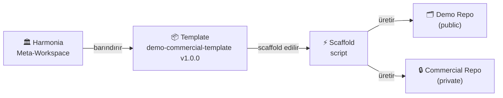

# Harmonia

**AI ajan destekli tam otomatik hazır proje template platformu.**

*Tema: uyum, düzen, denge.*

---

## Platform Nedir



Harmonia, yazılım projelerini **demo** (public) ve **commercial** (private) olarak iki bağımsız repo halinde yönetmek için gerekli workspace iskeletini ve CI/release altyapısını otomatik üretir.

---

## Temel Özellikler

<div class="grid cards" markdown>

- :material-folder-multiple-outline: **Manifest-Driven Yapı**

    Template içeriği `.github/template-manifest.yml` ile tanımlanır, her PR'da otomatik doğrulanır.

- :material-source-branch-check: **Single-Source Kuralı**

    Versiyon, changelog, README baseline ve manifest; birlikte taşınır, hiçbiri tek başına değişmez.

- :material-layers-outline: **Stack Overlay Sistemi**

    `node-service`, `python-service`, `nextjs-app` için hazır başlangıç dosyaları scaffold anında uygulanır.

- :material-tag-check-outline: **Tag-Gated Release**

    `main` branch'i yalnız tag'li durumları barındırır. Tagsiz merge kabul edilmez.

- :material-shield-lock-outline: **Gizlilik Öncelikli**

    Geliştirme süreci, backlog ve kararlar tamamen private repo'da yaşar; public yüz yalnız profesyonel içerik barındırır.

- :material-robot-outline: **Çoklu AI Ajan Desteği**

    Claude Code, GitHub Copilot ve diğer ajanlar için ortak operasyon kuralları tek kaynaktan yönetilir.

</div>

---

## Hızlı Başlangıç

Yeni bir workspace oluşturmak için:

=== "node-service"

    ```powershell
    pwsh -File ./templates/demo-commercial-template/development/scripts/scaffold-demo-commercial.ps1 `
        -TargetPath "D:\work\my-product-workspace" `
        -Stack node-service `
        -InitGitRepos
    ```

=== "python-service"

    ```powershell
    pwsh -File ./templates/demo-commercial-template/development/scripts/scaffold-demo-commercial.ps1 `
        -TargetPath "D:\work\my-product-workspace" `
        -Stack python-service `
        -InitGitRepos
    ```

=== "nextjs-app"

    ```powershell
    pwsh -File ./templates/demo-commercial-template/development/scripts/scaffold-demo-commercial.ps1 `
        -TargetPath "D:\work\my-product-workspace" `
        -Stack nextjs-app `
        -InitGitRepos
    ```

!!! tip "Gereksinim"
    PowerShell 7+ gereklidir. Linux/WSL'de `pwsh`, Windows'ta `powershell.exe` kullanın.

Adım adım kurulum için [Başlarken → Workspace Oluşturma](getting-started/scaffold.md) sayfasına gidin.

---

## Mevcut Template

| Template | Versiyon | Stack Desteği |
|----------|----------|---------------|
| [demo-commercial-template](templates/demo-commercial.md) | `v1.0.0` | node-service · python-service · nextjs-app |

---

## Lisans

TBD
