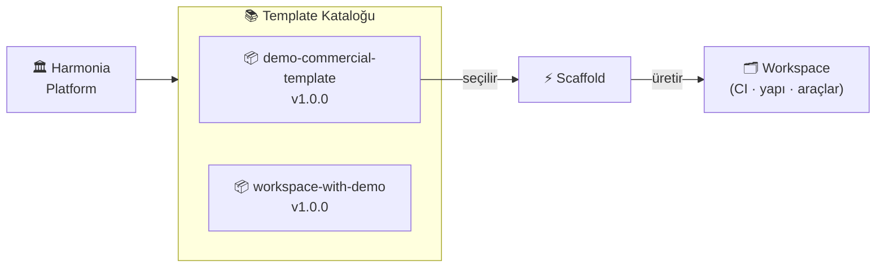

# Harmonia

**AI ajan destekli açık proje template platformu.**

*Tema: uyum, düzen, denge.*

---

## Platform Nedir

Harmonia, yazılım projelerine **hızlı, tutarlı ve güvenli bir başlangıç** sağlamak için tasarlanmış bir template platformudur. Her template belirli bir problemi çözmek ya da belirli bir mimari kararı karşılamak üzere hazırlanır; scaffold anında hazır workspace iskeletine, CI/release altyapısına ve araç entegrasyonlarına dönüşür.



---

## Temel Özellikler

<div class="grid cards" markdown>

- :material-view-grid-plus-outline: **Büyüyen Template Kataloğu**

    Her template farklı bir mimari karar veya problemi karşılar. Platform büyüdükçe katalog genişler; doğru template seçilir, workspace dakikalar içinde hazır olur.

- :material-file-document-check-outline: **Manifest-Driven Yapı**

    Her template kendi `.github/template-manifest.yml` contract'ıyla gelir. İçerik, PR'larda otomatik doğrulanır; beklenti dışı değişiklik CI'dan geçemez.

- :material-link-lock: **Single-Source Disiplini**

    Versiyon, changelog, README baseline ve manifest; birlikte taşınır, hiçbiri tek başına değişmez. Tutarsızlık pipeline tarafından engellenir.

- :material-rocket-launch-outline: **Scaffold Otomasyonu**

    Template seç, parametreleri ver — tek komutla hazır workspace, başlangıç dosyaları ve CI/CD altyapısı üretilir.

- :material-tag-check-outline: **Tag-Gated Release Disiplini**

    `main` branch yalnız tag'li durumları barındırır. Her template'de versiyon disiplini zorunludur; tagsiz merge kabul edilmez.

- :material-robot-outline: **AI Ajan Uyumu**

    Her template Claude Code, GitHub Copilot ve diğer ajanlar için hazır operasyon kurallarıyla gelir; AI desteği kurulum gerektirmez.

</div>

---

## Hızlı Başlangıç

!!! note "`demo-commercial-template` örneği"
    Aşağıdaki komutlar mevcut katalogdaki `demo-commercial-template` için gösterilmektedir.
    Diğer template'ler için aşağıdaki [Template Kataloğu](#template-kataloğu) bölümüne bakın.

=== "node-service"

    ```powershell
    pwsh -File ./templates/demo-commercial-template/development/scripts/scaffold-demo-commercial.ps1 `
        -TargetPath "D:\work\my-product-workspace" `
        -Stack node-service `
        -InitGitRepos
    ```

=== "python-service"

    ```powershell
    pwsh -File ./templates/demo-commercial-template/development/scripts/scaffold-demo-commercial.ps1 `
        -TargetPath "D:\work\my-product-workspace" `
        -Stack python-service `
        -InitGitRepos
    ```

=== "nextjs-app"

    ```powershell
    pwsh -File ./templates/demo-commercial-template/development/scripts/scaffold-demo-commercial.ps1 `
        -TargetPath "D:\work\my-product-workspace" `
        -Stack nextjs-app `
        -InitGitRepos
    ```

!!! tip "Gereksinim"
    PowerShell 7+ gereklidir. Linux/WSL'de ve Windows'ta `pwsh` kullanın.

Adım adım kurulum için [Başlarken → Workspace Oluşturma](getting-started/scaffold.md) sayfasına gidin.

---

## Template Kataloğu

| Template | Versiyon | Ne Çözer |
|----------|----------|----------|
| demo-commercial-template | `v1.0.0` | Bir ürünü public demo + private commercial olarak iki bağımsız repo halinde yönetme |
| workspace-with-demo | `v1.0.0` | Private workspace + public demo submodule; güvenli, filtrelenmis halka açık surum |

---

## Lisans

TBD
